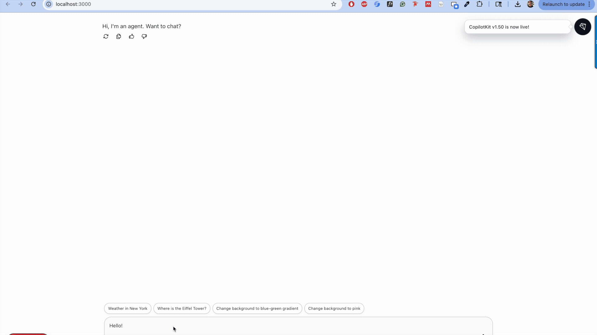

# Atlas App

## Overview
Atlas App is a full-stack application that provides users with real-time weather information and geographic details for a given location. Built with Python and Next.js, the application demonstrates how to integrate AG-UI with ADK to create engaging, agentic user experiences.



### Backend
- **Language**: Python (>=3.12)
- **Framework**: FastAPI
- **Libraries & tools**: 
  - `ag-ui-adk`: Agent Development Kit for AG-ui integration
  - `google-genai`: Google Generative AI SDK
  - `googlemaps`: Google Maps Services
  - `google-adk`: Google Agent Development Kit
  - `uv`: Python package manager

### Frontend
- **Framework**: Next.js 16 (React 19)
- **Styling**: Tailwind CSS 4
- **Libraries**:
  - `@ag-ui/client`: Client-side AG-UI integration
  - `@copilotkit/react-core`: CopilotKit AG-UI components
  - `@vis.gl/react-google-maps`: Google Maps react components.

## Prerequisites
- Python 3.12 or higher
- Node.js and npm
- Google Cloud API Keys (Maps, GenAI)

## Installation & Setup

### 1. Backend Setup
The backend is located in the root directory.

1.  **Install Dependencies**:
    This project uses `pyproject.toml`. You can install dependencies using `uv` or `pip`.
    ```bash
    # Using uv (recommended)
    uv sync

    # Or using pip
    pip install .
    ```

2.  **Environment Variables**:
    Create a `.env` file in the root directory and configure necessary API keys (e.g., `GOOGLE_API_KEY` for GenAI, `GOOGLE_MAPS_API_KEY`).

3.  **Run the Server**:
    ```bash
    python main.py
    ```
    The backend API will start at `http://localhost:8000`.

### 2. Frontend Setup
The frontend code is located in the `ui` directory.

1.  **Navigate to the UI directory**:
    ```bash
    cd ui
    ```

2.  **Install Dependencies**:
    ```bash
    npm install
    
    # or using yarn
    yarn install
    ```

3.  **Environment Variables**:
    Create a `.env.local` file in the `ui` directory. You may need to define variables such as:
    ```bash
    NEXT_PUBLIC_GOOGLE_MAPS_API_KEY=your_key_here
    ```

4.  **Run the Development Server**:
    ```bash
    npm run dev
    ```
    The application will be accessible at `http://localhost:3000`.

## Project Structure
- `agents/`: Contains the logic for the AI agents (e.g., `atlas_agent`).
- `ui/`: The Next.js frontend application.
- `main.py`: The entry point for the FastAPI backend server.
- `pyproject.toml`: Python project configuration and dependencies.

## Acknowledgements

This work was supported by Google ML Developer Programs and the Google Developers Program, which provided Google Cloud credits and high-quality technical resources #AISprint